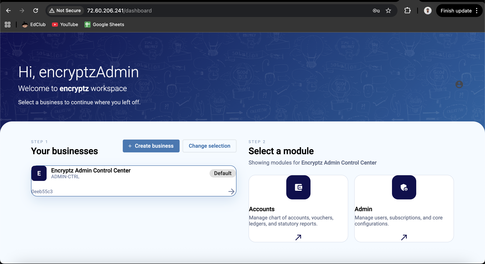
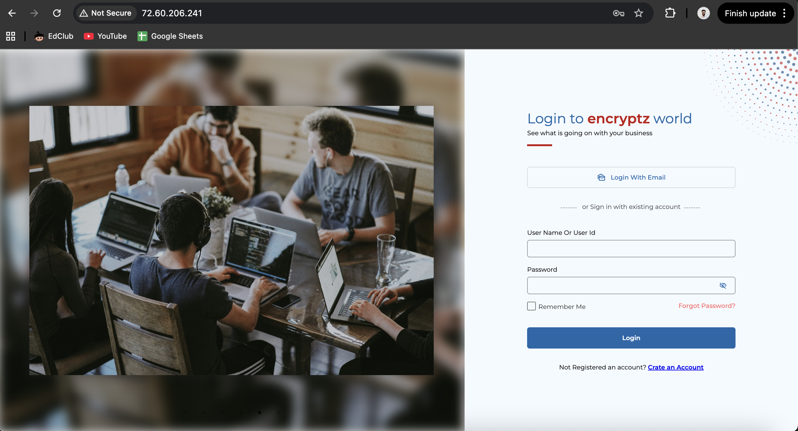
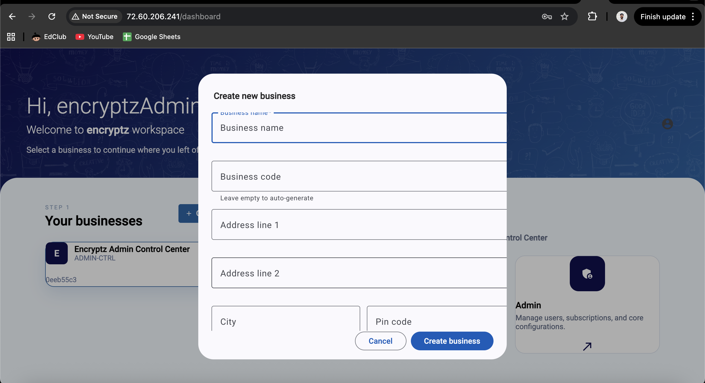
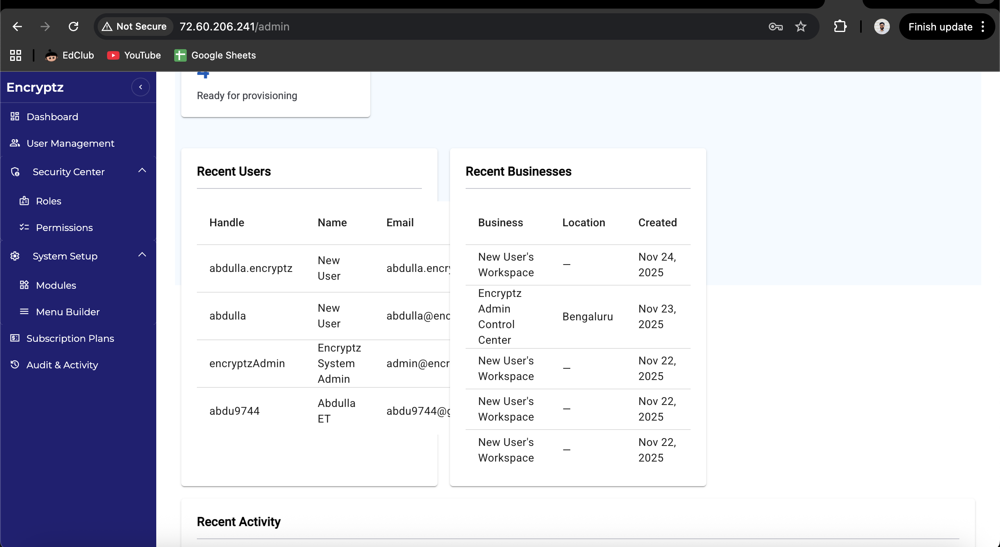
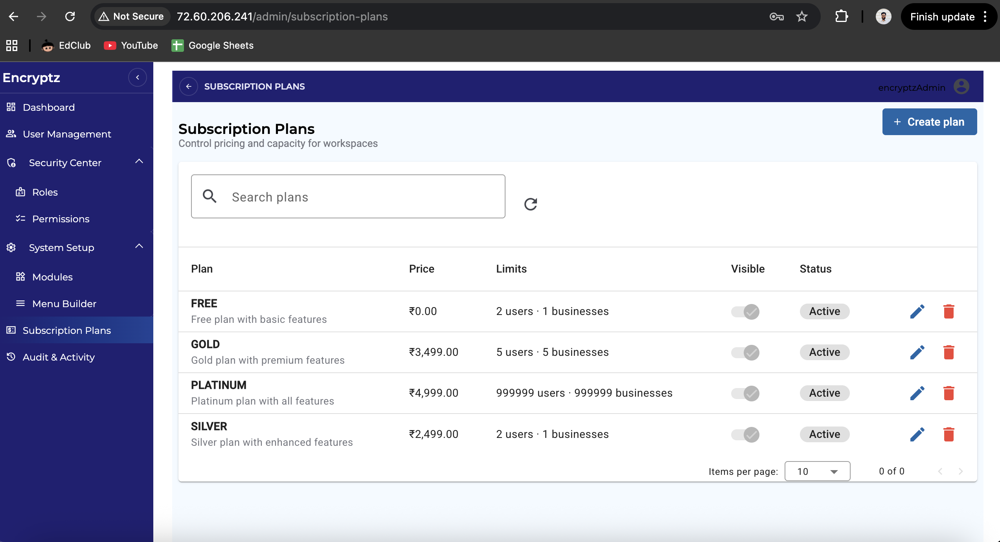
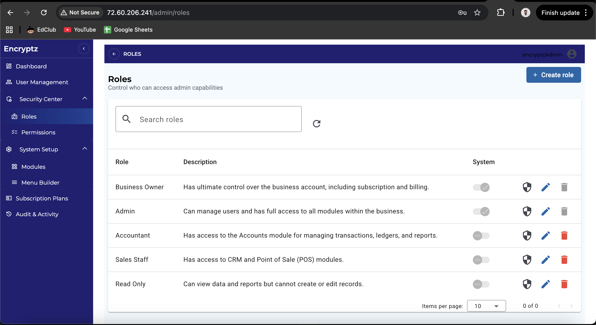
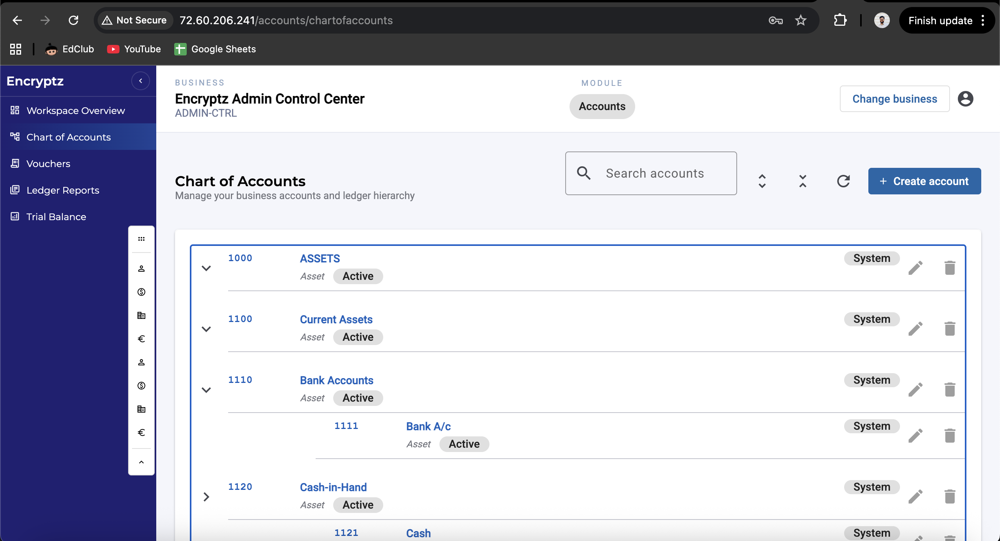
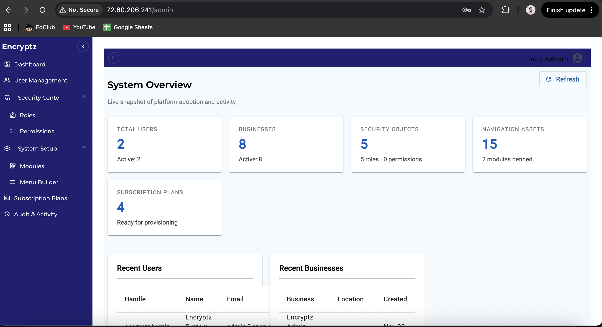
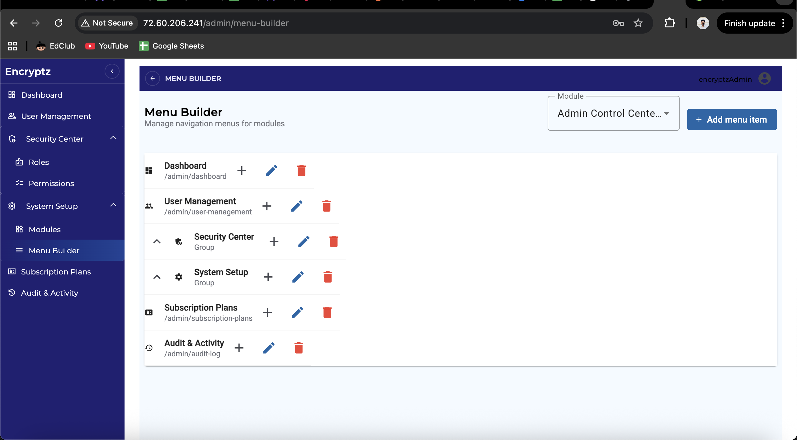
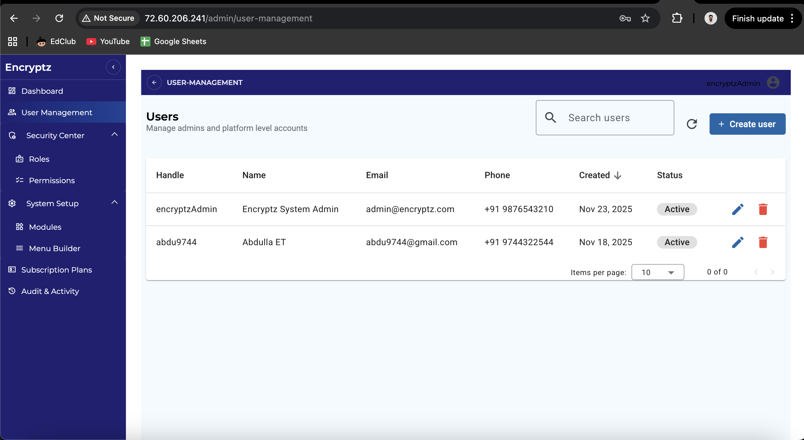

# Encryptz ERP - Functionality and Features Document

**Version:** 1.0  
**Date:** 23rd November 2025  
**Project:** Encryptz Accountz ERP - Core Module  
**Purpose:** Comprehensive feature documentation for stakeholders and end users

---

## Table of Contents

1. [Executive Summary](#executive-summary)
2. [System Overview](#system-overview)
3. [Core Features](#core-features)
4. [User Management & Authentication](#user-management--authentication)
5. [Business Management](#business-management)
6. [Subscription Management](#subscription-management)
7. [Role-Based Access Control (RBAC)](#role-based-access-control-rbac)
8. [Accounting Module](#accounting-module)
9. [Dashboard & Reporting](#dashboard--reporting)
10. [Audit & Compliance](#audit--compliance)
11. [User Interface Features](#user-interface-features)
12. [Security Features](#security-features)
13. [System Administration](#system-administration)

---

## Executive Summary

Encryptz ERP is a comprehensive Enterprise Resource Planning system built with modern technologies (.NET 8, Angular 17+, PostgreSQL) designed to manage accounting, business operations, and user access control. The system supports multi-tenant architecture where users can manage multiple businesses with role-based permissions and subscription-based feature access.

### Key Highlights

- **Multi-tenant Architecture**: Support for multiple businesses per user
- **Role-Based Access Control**: Granular permission system
- **Subscription Management**: Flexible subscription plans with feature-based access
- **Double-Entry Accounting**: Complete accounting module with vouchers, transactions, and ledgers
- **Audit Trail**: Comprehensive logging of all system activities
- **Modern UI**: Responsive Angular-based frontend with dynamic menu system
- **Secure Authentication**: JWT-based authentication with refresh token rotation

---

## System Overview

### Architecture

The system follows a layered architecture:

- **Frontend**: Angular 17+ with TypeScript
- **Backend**: .NET 8 Web API
- **Database**: PostgreSQL 14+
- **Authentication**: JWT with refresh token rotation
- **Deployment**: Linux-ready with Nginx reverse proxy support

### Technology Stack

**Backend:**
- .NET 8.0 / C# 12
- Entity Framework Core (Repository Pattern)
- AutoMapper for DTO mapping
- JWT Authentication
- PostgreSQL (Npgsql)

**Frontend:**
- Angular 17+
- Angular Material / PrimeNG
- RxJS for reactive programming
- TypeScript

**Infrastructure:**
- PostgreSQL Database
- Nginx (Reverse Proxy)
- Linux Deployment Support

---

## Core Features

### 1. Multi-Business Support

Users can create and manage multiple businesses within a single account. Each business operates independently with its own:
- Chart of Accounts
- Transactions and Vouchers
- Users and Roles
- Subscription Plan
- Financial Reports

**Key Functionality:**
- Create unlimited businesses (subject to subscription plan)
- Switch between businesses seamlessly
- Set default business for quick access
- Business-specific user roles and permissions

---

## User Management & Authentication

### Registration & Login

**Registration Features:**
- User handle (unique identifier)
- Email and/or mobile number
- PAN card number (encrypted storage)
- Aadhar number (optional, encrypted)
- Password with secure hashing (BCrypt)

**Login Features:**
- Email/Username and password login
- OTP-based login (via email/mobile)
- Google Sign-in (planned)
- Mobile OTP login (planned)
- JWT token-based authentication
- Refresh token rotation for security

### User Profile Management

- Complete user profile setup
- Profile completion tracking
- User handle management
- Contact information updates
- PAN/Aadhar verification status

### Password Management

- Secure password hashing (BCrypt)
- Password reset functionality
- Password strength validation
- Account lockout after failed attempts

---

## Business Management

### Business Creation

**Business Master Data:**
- Business Name
- Business Code (unique identifier)
- GSTIN (GST Identification Number)
- TAN Number
- Complete Address (Line 1, Line 2, City, State, PIN, Country)
- Active/Inactive status

### Business Operations

- View all businesses associated with user
- Set default business
- Edit business details
- Activate/Deactivate businesses
- Business-specific dashboard

---

## Subscription Management

### Subscription Plans

The system supports multiple subscription tiers with different features:

**Plan Features:**
- Maximum number of users
- Maximum number of businesses
- Feature-based permissions
- Pricing information
- Public visibility control

**Screenshot Placeholder:** 

### User Subscriptions

- Subscribe businesses to plans
- Track subscription status (Active, Expired, Trial, Cancelled)
- Trial period management
- Subscription start and end dates
- Automatic expiration handling

**Screenshot Placeholder:** 

### Subscription Status

- Active: Fully operational
- Expired: Access restricted
- Trial: Limited time access
- Cancelled: Subscription terminated

---

## Role-Based Access Control (RBAC)

### Roles

**System Roles:**
- **Business Owner**: Ultimate control over business account, subscription, and billing
- **Admin**: Full access to all modules within the business
- **Accountant**: Access to Accounts module for transactions, ledgers, and reports
- **Sales Staff**: Access to CRM and POS modules
- **Read Only**: View-only access to data and reports

**Custom Roles:**
- Create custom roles with specific permissions
- Assign permissions to roles
- Role-based menu visibility

**Screenshot Placeholder:** 

### Permissions

**Permission System:**
- Granular permission keys
- Module-based permissions
- Menu item associations
- Permission descriptions
- Subscription plan permissions

### User-Business-Role Assignment

- Assign users to businesses
- Assign roles to users within businesses
- Multiple roles per user per business
- Role-based UI visibility
- Permission-based API access

---

## Accounting Module

### Chart of Accounts

**Account Management:**
- Hierarchical account structure
- Account types (Asset, Liability, Equity, Income, Expense)
- Account codes and names
- Parent-child relationships
- Account status (Active/Inactive)
- Opening balances

**Screenshot Placeholder:** 

**Account Types:**
- Assets
- Liabilities
- Equity
- Income
- Expenses

**Screenshot Placeholder:** [Add screenshot of Account Types page]

### Transactions

**Transaction Management:**
- Create journal entries
- Double-entry bookkeeping validation
- Transaction headers and details
- Reference numbers
- Transaction dates
- Descriptions
- Debit/Credit validation

**Screenshot Placeholder:** [Add screenshot of transaction entry form]

**Transaction Features:**
- View all transactions
- Filter by date range
- Search by reference number
- View transaction details
- Edit draft transactions
- Delete transactions (with restrictions)

### Vouchers

**Voucher Types:**
- Payment Voucher
- Receipt Voucher
- Journal Voucher
- Contra Voucher
- Sales Voucher
- Purchase Voucher

**Voucher Workflow:**
1. Create draft voucher
2. Add voucher lines (debit/credit entries)
3. Validate double-entry balance
4. Post voucher (creates transactions)
5. Generate ledger entries

**Screenshot Placeholder:** [Add screenshot of voucher creation form]

**Voucher Features:**
- Draft management
- Post vouchers
- Voucher numbering
- Voucher status tracking
- Date-based filtering
- Type-based filtering

### Ledger

**Ledger Features:**
- Account-wise ledger view
- Opening balance display
- Transaction-wise balance
- Running balance calculation
- Date range filtering
- Export capabilities

**Screenshot Placeholder:** [Add screenshot of ledger view]

### Reports

**Financial Reports:**
- Trial Balance
- Profit & Loss Statement
- Balance Sheet
- Account Summary
- Transaction Reports

**Screenshot Placeholder:** [Add screenshot of reports page]

---

## Dashboard & Reporting

### Business Dashboard

**Dashboard Components:**
- Key Performance Indicators (KPIs)
- Recent Activities
- Quick Action Shortcuts
- Subscription Status
- Business Summary

**Screenshot Placeholder:** [Add screenshot of business dashboard]

**KPIs Include:**
- Total Transactions
- Total Vouchers
- Active Accounts
- Monthly Revenue (if applicable)
- Pending Items

**Recent Activities:**
- Latest transactions
- Recent vouchers
- User activities
- System events
- Audit log entries

**Screenshot Placeholder:** 

### Admin Dashboard

**Admin Features:**
- System-wide statistics
- User management overview
- Business statistics
- Subscription analytics
- System health monitoring

**Screenshot Placeholder:** 

---

## Audit & Compliance

### Audit Logging

**Audit Trail Features:**
- Track all data changes
- User action logging
- Timestamp recording
- Change details (before/after)
- Table and record tracking
- Operation type (INSERT, UPDATE, DELETE)

**Screenshot Placeholder:** ![\[Add screenshot of audit log viewer\]](../Screenshots/audit-log.png)

**Audit Information Captured:**
- User ID
- Operation type
- Table name
- Record ID
- Change description
- Timestamp (UTC)

### Compliance Features

- PAN card encryption
- Aadhar number encryption
- Secure password storage
- Data privacy compliance
- Audit trail for regulatory requirements

---

## User Interface Features

### Dynamic Menu System

**Menu Features:**
- Module-based organization
- Hierarchical menu structure
- Role-based visibility
- Permission-based access
- Icon support
- Custom display order

### Responsive Design

- Mobile-friendly interface
- Tablet optimization
- Desktop full-featured view
- Adaptive layouts
- Touch-friendly controls

### UI Components

**Shared Components:**
- Confirmation dialogs
- Loading indicators
- Snackbar notifications
- Form validations
- Data tables with pagination
- Search and filter controls

---

## Security Features

### Authentication Security

- JWT token-based authentication
- Refresh token rotation
- HTTP-only cookies for refresh tokens
- Token expiration management
- Secure token storage
- IP address tracking

### Data Security

- Encrypted PAN card storage
- Encrypted Aadhar storage
- BCrypt password hashing
- Secure API endpoints
- HTTPS enforcement
- CORS configuration

### Authorization

- Role-based access control
- Permission-based API access
- Business-level data isolation
- User-level data access
- API endpoint protection

---

## System Administration

### Module Management

**Module Features:**
- Create system modules
- Define module hierarchy
- Module activation/deactivation
- System module protection

**Screenshot Placeholder:** 

### Menu Builder

- Create menu items
- Define menu hierarchy
- Assign to modules
- Set display order
- Configure icons
- Set URLs and routes

**Screenshot Placeholder:** 

### Permission Management

- Create permissions
- Assign to modules
- Link to menu items
- Assign to roles
- Assign to subscription plans

### User Management (Admin)

- View all users
- Activate/Deactivate users
- View user details
- Manage user-business associations
- View user roles

**Screenshot Placeholder:** 

---

## Feature Summary Table

| Feature Category | Features | Status |
|-----------------|----------|--------|
| **Authentication** | Registration, Login, JWT, Refresh Tokens, OTP | ✅ Complete |
| **User Management** | Profile, Multi-business, User-Business-Role | ✅ Complete |
| **Business Management** | Create, Edit, Activate, Default Business | ✅ Complete |
| **Subscription** | Plans, Subscriptions, Status Tracking | ✅ Complete |
| **RBAC** | Roles, Permissions, Role-Permission Mapping | ✅ Complete |
| **Accounting** | Chart of Accounts, Transactions, Vouchers, Ledger | ✅ Complete |
| **Reports** | Trial Balance, P&L, Balance Sheet | ✅ Partial |
| **Dashboard** | KPIs, Recent Activities, Quick Actions | ✅ Complete |
| **Audit** | Audit Logging, Change Tracking | ✅ Complete |
| **Admin** | Module Management, Menu Builder, User Management | ✅ Complete |

---

## User Workflows

### New User Onboarding

1. User visits ERP website
2. Registration with email/mobile
3. OTP verification
4. Profile setup (PAN card, details)
5. Create first business OR explore with default business
6. Select subscription plan
7. Start using the system

**Screenshot Placeholder:** ![\[Add screenshot of onboarding flow\]](../Screenshots/Home-screen.png)

### Daily User Workflow

1. Login to system
2. Select business (if multiple)
3. View dashboard
4. Navigate to module (e.g., Accounts)
5. Perform actions (create voucher, view ledger)
6. View reports
7. Logout

**Screenshot Placeholder:** 

### Business Owner Workflow

1. Login
2. Select business
3. View subscription status
4. Manage users and roles
5. View financial reports
6. Manage subscription
7. View audit logs

**Screenshot Placeholder:** ![\[Add screenshot of business owner dashboard\]](../Screenshots/accounts-module-dashboard.png)

---

## System Requirements

### Browser Support

- Chrome (latest)
- Firefox (latest)
- Safari (latest)
- Edge (latest)

### Device Support

- Desktop (Windows, macOS, Linux)
- Tablet (iOS, Android)
- Mobile (iOS, Android)

### Network Requirements

- Internet connection
- HTTPS support
- API endpoint access

---

## Future Enhancements

### Planned Features

- **CRM Module**: Customer relationship management
- **POS Module**: Point of sale integration
- **Inventory Management**: Stock tracking
- **Advanced Reporting**: Custom report builder
- **Mobile App**: Native iOS and Android apps
- **Email Integration**: Automated email notifications
- **Payment Gateway**: Subscription payment processing
- **Multi-currency**: Support for multiple currencies
- **Tax Management**: GST, TDS, and other tax calculations

---

## Support & Documentation

### Additional Documentation

- Technical Documentation (for developers)
- API Documentation (Swagger)
- Database Schema Documentation
- Deployment Guide
- Testing Documentation

### Contact Information

For support and queries, please refer to the project repository or contact the development team.

---

## Appendix

### Glossary

- **RBAC**: Role-Based Access Control
- **JWT**: JSON Web Token
- **OTP**: One-Time Password
- **GSTIN**: GST Identification Number
- **TAN**: Tax Deduction and Collection Account Number
- **PAN**: Permanent Account Number
- **KPI**: Key Performance Indicator
- **P&L**: Profit & Loss Statement

### Version History

| Version | Date | Changes |
|---------|------|---------|
| 1.0 | 23rd November 2025 | Initial documentation |

---

**Last Updated:** 23rd November 2025  

