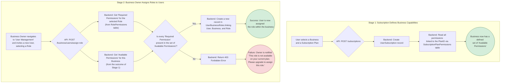

```mermaid
graph TD
    subgraph "Stage 1: Subscription Defines Business Capabilities"
        A[User selects a Business <br>and a Subscription Plan] --> B{API: POST /subscriptions};
        B --> C[Backend: Create UserSubscription record];
        C --> D[Backend: Read all permissions <br>linked to the PlanID via <br>SubscriptionPlanPermissions table];
        D --> E((Business now has a defined <br>set of 'Available Permissions'));
    end

    subgraph "Stage 2: Business Owner Assigns Roles to Users"
        F[Business Owner navigates to 'User Management' <br>and invites a new User, selecting a Role];
        F --> G{API: POST /business/users/assign-role};
        G --> H["Backend: Get 'Available Permissions' for this Business <br> (from the outcome of Stage 1)"];
        G --> I["Backend: Get 'Required Permissions' for the selected Role <br> (from RolePermissions table)"];
        
        I --> J{Is every 'Required Permission' <br> present in the set of <br> 'Available Permissions'?};
        H --> J;

        J -- Yes --> K[Backend: Create a new record in <br> UserBusinessRoles linking User, Business, and Role];
        K --> L((Success: User is now assigned <br> the role within the business));

        J -- No --> M[Backend: Return 403 Forbidden Error];
        M --> N((Failure: Owner is notified <br> 'This role is not available on your current plan. <br> Please upgrade to assign this role.'));
    end

    style E fill:#d4edda,stroke:#155724
    style L fill:#d4edda,stroke:#155724
    style N fill:#f8d7da,stroke:#721c24

```