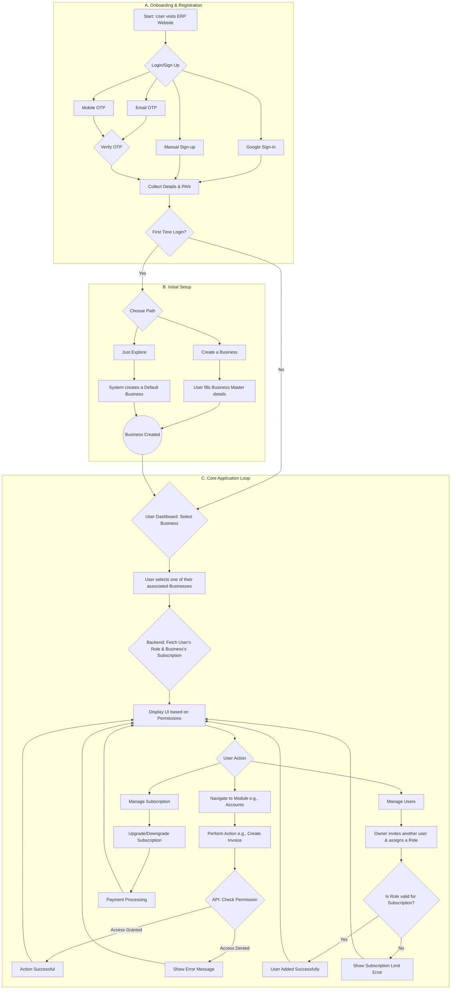

```mermaid

graph TD
    subgraph "A. Onboarding & Registration"
        A0(Start: User visits ERP Website) --> A1{Login/Sign Up};
        A1 --> A2_1[Email OTP];
        A1 --> A2_2[Google Sign-in];
        A1 --> A2_3[Mobile OTP];
        A1 --> A2_4[Manual Sign-up];
        
        A2_1 --> A3{Verify OTP};
        A2_2 --> A4;
        A2_3 --> A3;
        A2_4 --> A4[Collect Details & PAN];

        A3 --> A4;
        A4 --> A5{First Time Login?};
    end

    subgraph "B. Initial Setup"
        A5 -- Yes --> B1{Choose Path};
        B1 --> B2[Create a Business];
        B1 --> B3[Just Explore];

        B2 --> B4[User fills Business Master details];
        B3 --> B5[System creates a Default Business];
        
        B4 --> B6((Business Created));
        B5 --> B6;
    end

    subgraph "C. Core Application Loop"
        A5 -- No --> C1;
        B6 --> C1{User Dashboard: Select Business};
        C1 --> C2[User selects one of their associated Businesses];
        C2 --> C3{Backend: Fetch User's Role & Business's Subscription};
        C3 --> C4[Display UI based on Permissions];
        
        C4 --> C5{User Action};
        C5 --> C6[Navigate to Module e.g., Accounts];
        C5 --> C7[Manage Users];
        C5 --> C8[Manage Subscription];
        
        C6 --> C9[Perform Action e.g., Create Invoice];
        C9 --> C10{API: Check Permission};
        C10 -- Access Granted --> C11[Action Successful];
        C10 -- Access Denied --> C12[Show Error Message];
        C11 --> C4;
        C12 --> C4;

            C7 --> C13[Owner invites another user & assigns a Role];
            C13 --> C14{Is Role valid for Subscription?};
            C14 -- Yes --> C15[User Added Successfully];
            C14 -- No --> C16[Show Subscription Limit Error];
            C15 --> C4;
            C16 --> C4;
    
            C8 --> C17[Upgrade/Downgrade Subscription];
            C17 --> C18[Payment Processing];
            C18 --> C4;
        end
        

```
