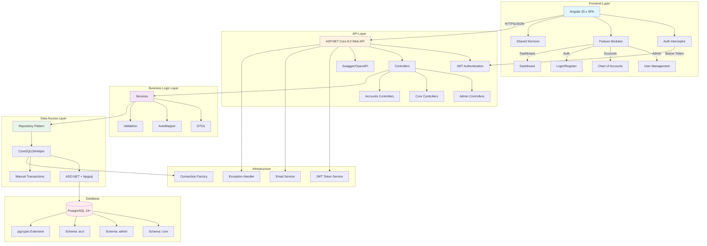

# Repository Technical Audit Report
**encryptzAccountzERP - Accounts ERP System**  
**Date:** 2025-11-20  
**Audit Scope:** Full stack .NET Core + Angular + PostgreSQL ERP solution

---

## Executive Summary

- **Architecture:** Modern 3-tier architecture with .NET 8.0 Web API backend, Angular 20.x frontend, and PostgreSQL 14+ database. The solution follows clean architecture principles with separation of concerns across 7 backend projects (API, BusinessLogic, Repository, Entities, Infrastructure, Shared, Data).

- **Data Access Pattern:** **ADO.NET with raw SQL** via `CoreSQLDbHelper` and Npgsql - no ORM (EF Core/Dapper) is used. This provides performance control but increases SQL injection risk and maintenance overhead. Transaction management is manual with explicit Begin/Commit/Rollback.

- **Security Implementation:** JWT Bearer authentication with role-based authorization, encrypted sensitive data (PAN, Aadhar) using pgcrypto, CORS enabled for all origins. Credentials are hardcoded in appsettings.json (CRITICAL SECURITY ISSUE).

- **Testing & CI/CD:** **NO automated tests found** - no unit tests, integration tests, or test projects exist. **NO CI/CD pipelines** detected (no .yml, Dockerfile, docker-compose, or deployment scripts). Manual deployment only.

- **Current State:** Core modules implemented include Users, Businesses, Subscriptions, Roles/Permissions, Chart of Accounts, Transactions, and Audit logging. Frontend has modular Angular structure with lazy-loaded feature modules. Database migrations are tracked in DB-Backup folder with comprehensive PostgreSQL schemas.

---

## System Architecture Diagram



---

## File Inventory: Top 25 Key Files/Folders

| # | Path | Type | Significance |
|---|------|------|--------------|
| 1 | `/CoreModule/API/encryptzERP.sln` | Solution | Main solution file with 7 projects |
| 2 | `/CoreModule/API/encryptzERP/Program.cs` | Entry Point | Application startup, DI configuration, middleware pipeline |
| 3 | `/CoreModule/API/encryptzERP/appsettings.json` | Config | **CRITICAL** - Contains DB credentials, JWT secrets, email passwords |
| 4 | `/CoreModule/API/Infrastructure/CoreSqlDbHelper.cs` | Data Access | Core ADO.NET wrapper for all database operations |
| 5 | `/CoreModule/API/Infrastructure/jwtToken/TokenService.cs` | Security | JWT access/refresh token generation logic |
| 6 | `/CoreModule/API/Infrastructure/ExceptionHandler.cs` | Logging | Centralized error logging to database |
| 7 | `/CoreModule/API/Business/BusinessLogic.csproj` | Project | Business logic layer with 18 services |
| 8 | `/CoreModule/API/Repository/Repository.csproj` | Project | Data access layer with 18 repositories |
| 9 | `/CoreModule/API/Entities/Entities.csproj` | Project | Domain models and entities |
| 10 | `/CoreModule/API/encryptzERP/Controllers/Core/LoginController.cs` | API | Authentication endpoints (login, OTP, password reset) |
| 11 | `/CoreModule/API/encryptzERP/Controllers/Admin/UserController.cs` | API | User CRUD operations |
| 12 | `/CoreModule/API/encryptzERP/Controllers/Core/BusinessController.cs` | API | Business entity management with policy authorization |
| 13 | `/CoreModule/API/encryptzERP/Controllers/Accounts/TransactionsController.cs` | API | Financial transaction management |
| 14 | `/CoreModule/API/encryptzERP/Controllers/Accounts/ChartOfAccountsController.cs` | API | Chart of accounts management |
| 15 | `/CoreModule/API/DB-Backup/Complete_Schema_PostgreSQL.sql` | Database | Complete PostgreSQL schema with all tables |
| 16 | `/CoreModule/API/DB-Backup/MIGRATION_README.md` | Documentation | Database migration procedures and rollback guides |
| 17 | `/CoreModule/API/DB-Backup/IMPLEMENTATION_SUMMARY.md` | Documentation | Summary of implemented features and changes |
| 18 | `/CoreModule/UI/Admin/encryptz.Admin/package.json` | Frontend | Angular 20.x with Material UI, PrimeNG, NgRx dependencies |
| 19 | `/CoreModule/UI/Admin/encryptz.Admin/angular.json` | Frontend | Angular build configuration |
| 20 | `/CoreModule/UI/Admin/encryptz.Admin/src/app/app.routes.ts` | Frontend | Application routing configuration |
| 21 | `/CoreModule/UI/Admin/encryptz.Admin/src/app/core/interceptor/auth.interceptor.ts` | Frontend | JWT token injection and loader management |
| 22 | `/CoreModule/UI/Admin/encryptz.Admin/src/app/features/auth/auth.service.ts` | Frontend | Authentication service with token management |
| 23 | `/CoreModule/UI/Admin/encryptz.Admin/src/app/features/admin/components/` | Frontend | Admin feature module with user management |
| 24 | `/CoreModule/UI/Admin/encryptz.Admin/src/app/features/accounts/` | Frontend | Accounts feature module with chart of accounts |
| 25 | `/CoreModule/Documentations/ERP-Accountz-core.md` | Documentation | Project overview with phase planning and architecture |

---

## Public API Endpoints Discovered

### Authentication & Login (`/api/Login`)
| Method | Endpoint | Description | Auth Required |
|--------|----------|-------------|---------------|
| POST | `/api/Login/login` | User login with credentials | No |
| POST | `/api/Login/request-otp` | Request OTP for authentication | No |
| POST | `/api/Login/verify-otp` | Verify OTP and get JWT token | No |
| POST | `/api/Login/forgot-password` | Request password reset OTP | No |
| POST | `/api/Login/reset-password` | Reset password with OTP | No |
| POST | `/api/Login/change-password` | Change password for authenticated user | Yes (Bearer) |

### User Management (`/api/User`)
| Method | Endpoint | Description | Auth Required |
|--------|----------|-------------|---------------|
| GET | `/api/User` | Get all users | Yes (Bearer) |
| GET | `/api/User/{id}` | Get user by ID | Yes (Bearer) |
| POST | `/api/User` | Create new user | Yes (Bearer) |
| PUT | `/api/User/{id}` | Update user | Yes (Bearer) |
| DELETE | `/api/User/{id}` | Delete user | Yes (Bearer) |

### Business Management (`/api/Business`)
| Method | Endpoint | Description | Auth Required |
|--------|----------|-------------|---------------|
| GET | `/api/Business` | Get all businesses | Yes (Policy: CanManageBusinesses) |
| GET | `/api/Business/{id}` | Get business by ID | Yes (Policy: CanManageBusinesses) |
| POST | `/api/Business` | Create new business | Yes (Policy: CanManageBusinesses) |
| PUT | `/api/Business/{id}` | Update business | Yes (Policy: CanManageBusinesses) |
| DELETE | `/api/Business/{id}` | Delete business | Yes (Policy: CanManageBusinesses) |

### Roles Management (`/api/Roles`)
| Method | Endpoint | Description | Auth Required |
|--------|----------|-------------|---------------|
| GET | `/api/Roles` | Get all roles | Yes (Bearer) |
| GET | `/api/Roles/{id}` | Get role by ID | Yes (Bearer) |
| POST | `/api/Roles` | Create new role | Yes (Bearer) |
| PUT | `/api/Roles/{id}` | Update role | Yes (Bearer) |
| DELETE | `/api/Roles/{id}` | Delete role | Yes (Bearer) |

### Permissions Management (`/api/Permissions`)
| Method | Endpoint | Description | Auth Required |
|--------|----------|-------------|---------------|
| GET | `/api/Permissions` | Get all permissions | Yes (Bearer) |
| GET | `/api/Permissions/{id}` | Get permission by ID | Yes (Bearer) |
| POST | `/api/Permissions` | Create new permission | Yes (Bearer) |
| PUT | `/api/Permissions/{id}` | Update permission | Yes (Bearer) |
| DELETE | `/api/Permissions/{id}` | Delete permission | Yes (Bearer) |

### Role Permissions (`/api/RolePermissions`)
| Method | Endpoint | Description | Auth Required |
|--------|----------|-------------|---------------|
| GET | `/api/RolePermissions` | Get all role-permission mappings | Yes (Bearer) |
| GET | `/api/RolePermissions/{id}` | Get role-permission by ID | Yes (Bearer) |
| POST | `/api/RolePermissions` | Assign permission to role | Yes (Bearer) |
| DELETE | `/api/RolePermissions/{id}` | Remove permission from role | Yes (Bearer) |

### Modules Management (`/api/Module`)
| Method | Endpoint | Description | Auth Required |
|--------|----------|-------------|---------------|
| GET | `/api/Module` | Get all modules | Yes (Bearer) |
| GET | `/api/Module/{id}` | Get module by ID | Yes (Bearer) |
| POST | `/api/Module` | Create new module | Yes (Bearer) |
| PUT | `/api/Module/{id}` | Update module | Yes (Bearer) |
| DELETE | `/api/Module/{id}` | Delete module | Yes (Bearer) |

### Menu Items (`/api/MenuItem`)
| Method | Endpoint | Description | Auth Required |
|--------|----------|-------------|---------------|
| GET | `/api/MenuItem` | Get all menu items | Yes (Bearer) |
| GET | `/api/MenuItem/{id}` | Get menu item by ID | Yes (Bearer) |
| POST | `/api/MenuItem` | Create new menu item | Yes (Bearer) |
| PUT | `/api/MenuItem/{id}` | Update menu item | Yes (Bearer) |
| DELETE | `/api/MenuItem/{id}` | Delete menu item | Yes (Bearer) |

### Subscription Plans (`/api/SubscriptionPlans`)
| Method | Endpoint | Description | Auth Required |
|--------|----------|-------------|---------------|
| GET | `/api/SubscriptionPlans` | Get all subscription plans | No (appears unauthenticated) |
| GET | `/api/SubscriptionPlans/{id}` | Get plan by ID | No |
| POST | `/api/SubscriptionPlans` | Create new plan | No |
| PUT | `/api/SubscriptionPlans/{id}` | Update plan | No |
| DELETE | `/api/SubscriptionPlans/{id}` | Delete plan | No |

### User Subscriptions (`/api/UserSubscriptions`)
| Method | Endpoint | Description | Auth Required |
|--------|----------|-------------|---------------|
| GET | `/api/UserSubscriptions` | Get all user subscriptions | Yes (Bearer) |
| GET | `/api/UserSubscriptions/{id}` | Get subscription by ID | Yes (Bearer) |
| POST | `/api/UserSubscriptions` | Create subscription | Yes (Bearer) |
| PUT | `/api/UserSubscriptions/{id}` | Update subscription | Yes (Bearer) |
| DELETE | `/api/UserSubscriptions/{id}` | Delete subscription | Yes (Bearer) |

### Subscription Plan Permissions (`/api/SubscriptionPlanPermissions`)
| Method | Endpoint | Description | Auth Required |
|--------|----------|-------------|---------------|
| GET | `/api/SubscriptionPlanPermissions` | Get all plan permissions | Yes (Bearer) |
| GET | `/api/SubscriptionPlanPermissions/{id}` | Get plan permission by ID | Yes (Bearer) |
| POST | `/api/SubscriptionPlanPermissions` | Assign permission to plan | Yes (Bearer) |
| DELETE | `/api/SubscriptionPlanPermissions/{id}` | Remove permission from plan | Yes (Bearer) |

### User Business Roles (`/api/UserBusinessRoles`)
| Method | Endpoint | Description | Auth Required |
|--------|----------|-------------|---------------|
| GET | `/api/UserBusinessRoles` | Get all user-business-role mappings | Yes (Bearer) |
| GET | `/api/UserBusinessRoles/{id}` | Get mapping by ID | Yes (Bearer) |
| POST | `/api/UserBusinessRoles` | Assign role to user in business | Yes (Bearer) |
| DELETE | `/api/UserBusinessRoles/{id}` | Remove user-business-role | Yes (Bearer) |

### User Businesses (`/api/UserBusinesses`)
| Method | Endpoint | Description | Auth Required |
|--------|----------|-------------|---------------|
| GET | `/api/UserBusinesses` | Get all user-business relationships | Yes (Bearer) |
| GET | `/api/UserBusinesses/{id}` | Get relationship by ID | Yes (Bearer) |
| POST | `/api/UserBusinesses` | Create user-business relationship | Yes (Bearer) |
| DELETE | `/api/UserBusinesses/{id}` | Remove user-business relationship | Yes (Bearer) |

### Core Users (`/api/Users`)
| Method | Endpoint | Description | Auth Required |
|--------|----------|-------------|---------------|
| GET | `/api/Users` | Get all core users | Yes (Bearer) |
| GET | `/api/Users/{id}` | Get user by ID | Yes (Bearer) |
| GET | `/api/Users/{userId}/default-business` | Get user's default business | Yes (Bearer) |

### Account Types (`/api/AccountTypes`)
| Method | Endpoint | Description | Auth Required |
|--------|----------|-------------|---------------|
| GET | `/api/AccountTypes` | Get all account types | Yes (Bearer) |
| GET | `/api/AccountTypes/{id}` | Get account type by ID | Yes (Bearer) |
| POST | `/api/AccountTypes` | Create new account type | Yes (Bearer) |
| PUT | `/api/AccountTypes/{id}` | Update account type | Yes (Bearer) |
| DELETE | `/api/AccountTypes/{id}` | Delete account type | Yes (Bearer) |

### Chart of Accounts (`/api/ChartOfAccounts`)
| Method | Endpoint | Description | Auth Required |
|--------|----------|-------------|---------------|
| GET | `/api/ChartOfAccounts/business/{businessId}` | Get COA for business | Yes (Bearer) |
| GET | `/api/ChartOfAccounts/{id}` | Get account by ID | Yes (Bearer) |
| POST | `/api/ChartOfAccounts` | Create new account | Yes (Bearer) |
| PUT | `/api/ChartOfAccounts/{id}` | Update account | Yes (Bearer) |
| DELETE | `/api/ChartOfAccounts/{id}` | Delete account | Yes (Bearer) |

### Transactions (`/api/Transactions`)
| Method | Endpoint | Description | Auth Required |
|--------|----------|-------------|---------------|
| GET | `/api/Transactions/business/{businessId}` | Get transactions for business | Yes (Bearer) |
| GET | `/api/Transactions/{id}` | Get transaction by ID | Yes (Bearer) |
| POST | `/api/Transactions` | Create new transaction | Yes (Bearer) |
| PUT | `/api/Transactions/{id}` | Update transaction header | Yes (Bearer) |
| DELETE | `/api/Transactions/{id}` | Delete transaction | Yes (Bearer) |

**Total Endpoints: ~97 REST endpoints across 18 controllers**

---

## Technology Stack Breakdown

### Backend Technologies
| Layer | Technology | Version | Notes |
|-------|-----------|---------|-------|
| Framework | .NET Core | 8.0 | Latest LTS version |
| Language | C# | 12.0 | With nullable reference types enabled |
| Data Access | ADO.NET | Built-in | Manual SQL with Npgsql driver |
| Database Driver | Npgsql | 8.0.5 | PostgreSQL .NET driver |
| Authentication | JWT Bearer | ASP.NET Core 8.0.11 | Manual token service implementation |
| API Documentation | Swashbuckle | 6.4.0 | Swagger/OpenAPI support |
| Email | MailKit | 4.10.0 | SMTP email service |
| Mapping | AutoMapper | 12.0.1 | DTO mapping in business layer |
| Architecture | Layered | Custom | 7 projects with clear separation |

### Frontend Technologies
| Category | Technology | Version | Notes |
|----------|-----------|---------|-------|
| Framework | Angular | 20.1.0 | Latest major version |
| Language | TypeScript | 5.8.3 | Strict mode enabled |
| UI Library | Angular Material | 20.1.0 | Primary UI components |
| UI Library | PrimeNG | 19.0.7 | Additional rich components |
| State Management | NgRx Store | 19.0.1 | Redux pattern for Angular |
| Notifications | ngx-toastr | 19.0.0 | Toast notifications |
| Carousel | ngx-slick-carousel | 19.0.0 | Image/content carousel |
| Testing | Jasmine/Karma | 5.5.0 / 6.4.0 | Testing frameworks (unused) |
| Build | Angular CLI | 20.1.0 | Build and dev tools |

### Database Technologies
| Component | Technology | Version | Notes |
|-----------|-----------|---------|-------|
| RDBMS | PostgreSQL | 14+ | Production database |
| Extension | pgcrypto | Built-in | For PAN/Aadhar encryption |
| Schemas | Multiple | N/A | core, admin, acct schemas |
| Migrations | SQL Scripts | Manual | Tracked in DB-Backup folder |

### Infrastructure
| Component | Technology | Status | Notes |
|-----------|-----------|--------|-------|
| CI/CD | None | ❌ Missing | No automation detected |
| Containerization | None | ❌ Missing | No Docker files found |
| Unit Tests | None | ❌ Missing | No test projects found |
| Integration Tests | None | ❌ Missing | No test projects found |
| API Testing | Postman | ✓ Manual | POSTMAN_TESTS.md exists |
| Logging | Database | ✓ Custom | error_logs table in database |

---

## Top 10 Critical Risks & Missing Components

### 🔴 CRITICAL (P0) - Immediate Action Required

#### 1. **Hardcoded Credentials in Source Control**
- **Risk Level:** CRITICAL - P0
- **Location:** `/CoreModule/API/encryptzERP/appsettings.json`
- **Issue:** Database passwords, JWT secrets, and email credentials are committed to repository in plain text
  - PostgreSQL password: `encryptzDB#12`
  - JWT secret key: `encryptzSecretCodeForDreamProject9876543210`
  - Email password: `@ekm35HAM`
  - Database IP: `72.60.206.241` exposed
- **Impact:** Complete system compromise if repository is leaked; credentials visible to all developers
- **Recommendation:** 
  - Immediately move all secrets to environment variables or Azure Key Vault
  - Use .NET Secret Manager for local development
  - Rotate all exposed credentials immediately
  - Add appsettings.json to .gitignore (use appsettings.example.json instead)
  - Implement IConfiguration with environment-specific overrides

#### 2. **SQL Injection Vulnerability Risk**
- **Risk Level:** HIGH - P0
- **Location:** All repositories using `CoreSQLDbHelper`
- **Issue:** Manual SQL string concatenation with parameters - while Npgsql parameterization is used, there's no second layer of defense
- **Impact:** Potential database compromise, data theft, or data manipulation
- **Code Example:**
  ```csharp
  var query = "INSERT INTO core.users (user_id, ...) VALUES (@UserId, ...)";
  ```
- **Recommendation:**
  - Add input validation layer before repository calls
  - Consider migrating to Dapper or EF Core for query safety
  - Implement SQL injection testing in security audit
  - Add stored procedures for complex queries
  - Use parameterized queries exclusively (already done, but verify all instances)

#### 3. **No Automated Testing Infrastructure**
- **Risk Level:** HIGH - P0
- **Issue:** Zero unit tests, integration tests, or E2E tests found
- **Impact:** 
  - High regression risk with every code change
  - No safety net for refactoring
  - Difficult to validate business logic correctness
  - Manual QA bottleneck
- **Recommendation:**
  - Create test projects: `encryptzERP.Tests`, `BusinessLogic.Tests`, `Repository.Tests`
  - Add xUnit or NUnit as testing framework
  - Implement test coverage for critical paths (authentication, transactions)
  - Add integration tests for database operations
  - Target 60%+ code coverage minimum
  - Add test runs to pre-commit hooks

---

### 🟡 HIGH (P1) - Address Soon

#### 4. **No CI/CD Pipeline**
- **Risk Level:** HIGH - P1
- **Issue:** No automated build, test, or deployment pipelines detected
- **Impact:** 
  - Manual deployment errors likely
  - No automated quality gates
  - Slow release cycles
  - Inconsistent builds across environments
- **Missing Files:** No `.github/workflows/*.yml`, `azure-pipelines.yml`, `.gitlab-ci.yml`, Dockerfile, or docker-compose.yml
- **Recommendation:**
  - Implement GitHub Actions or Azure DevOps pipelines
  - Add build, test, and deploy stages
  - Create Dockerfile for containerization
  - Implement environment-specific deployments (dev/staging/prod)
  - Add database migration automation
  - Consider using Docker Compose for local development

#### 5. **CORS Policy Too Permissive**
- **Risk Level:** HIGH - P1
- **Location:** `Program.cs` line 52-56
- **Issue:** `AllowAnyOrigin()` allows requests from any domain
- **Code:**
  ```csharp
  options.AddPolicy("AllowEncryptzCorsPolicy",
      builder => builder
          .AllowAnyOrigin()  // SECURITY ISSUE
          .AllowAnyMethod()
          .AllowAnyHeader());
  ```
- **Impact:** Vulnerable to CSRF attacks, unauthorized API access from malicious websites
- **Recommendation:**
  - Replace with `.WithOrigins("https://yourdomain.com")`
  - Use environment variables for CORS origins
  - Consider different CORS policies per environment
  - Add origin validation middleware

#### 6. **No Centralized Logging or Monitoring**
- **Risk Level:** MEDIUM-HIGH - P1
- **Issue:** Only database error logging via `ExceptionHandler`, no application insights, structured logging, or APM
- **Impact:** 
  - Difficult to diagnose production issues
  - No performance metrics visibility
  - Cannot track user behavior or API usage
  - Error logs only stored in database (could fill disk)
- **Recommendation:**
  - Integrate Serilog for structured logging
  - Add Application Insights or Elastic APM
  - Implement log rotation for database error_logs
  - Add correlation IDs for request tracing
  - Set up alerts for critical errors
  - Add health check endpoints

---

### 🟠 MEDIUM (P2) - Plan to Address

#### 7. **Missing Input Validation Framework**
- **Risk Level:** MEDIUM - P2
- **Issue:** No FluentValidation or Data Annotations visible in DTOs
- **Impact:** Invalid data can reach database layer, causing runtime errors
- **Recommendation:**
  - Add FluentValidation package
  - Create validators for all DTOs
  - Add model validation middleware
  - Return proper 400 Bad Request responses with validation errors
  - Example:
    ```csharp
    public class UserCreateDtoValidator : AbstractValidator<UserCreateDto>
    {
        public UserCreateDtoValidator()
        {
            RuleFor(x => x.Email).NotEmpty().EmailAddress();
            RuleFor(x => x.Password).MinimumLength(8);
        }
    }
    ```

#### 8. **No API Rate Limiting or Throttling**
- **Risk Level:** MEDIUM - P2
- **Issue:** No rate limiting middleware detected in `Program.cs`
- **Impact:** Vulnerable to DDoS attacks, brute force attacks on login endpoints
- **Recommendation:**
  - Add AspNetCoreRateLimit package
  - Implement rate limiting per IP/user
  - Add specific limits for authentication endpoints
  - Example limits:
    - Login: 5 attempts per minute
    - OTP request: 3 attempts per hour
    - General API: 100 requests per minute

#### 9. **Lack of Database Connection Pooling Configuration**
- **Risk Level:** MEDIUM - P2
- **Location:** `CoreSQLDbHelper.cs` and connection string
- **Issue:** No explicit connection pooling configuration, creating new connections frequently
- **Impact:** Performance degradation under load, potential connection exhaustion
- **Recommendation:**
  - Add connection pool settings to connection string:
    ```
    Host=...;Pooling=true;MinPoolSize=5;MaxPoolSize=100;ConnectionLifetime=300
    ```
  - Implement connection factory pattern properly
  - Add connection monitoring
  - Use using statements consistently (already done well)

---

### 🟢 LOW (P3) - Future Improvements

#### 10. **Documentation & Code Comments**
- **Risk Level:** LOW - P3
- **Issue:** Limited XML documentation comments in code, no developer onboarding guide
- **Impact:** Slower developer onboarding, knowledge silos
- **Recommendation:**
  - Add XML doc comments to public APIs
  - Create API documentation beyond Swagger
  - Add README files in each project folder
  - Document architectural decisions (ADRs)
  - Create deployment runbooks
  - Add code examples in documentation

---

## Additional Observations

### Strengths
- ✅ Clean separation of concerns with 7-layer architecture
- ✅ Consistent use of async/await patterns throughout
- ✅ Repository and Service patterns well implemented
- ✅ AutoMapper for DTO transformations
- ✅ Comprehensive database schema with proper foreign keys
- ✅ JWT authentication with policy-based authorization
- ✅ Encrypted sensitive data (PAN, Aadhar) at database level
- ✅ Modern Angular 20.x with TypeScript and lazy loading
- ✅ Audit logging framework in place
- ✅ Migration tracking with SQL scripts
- ✅ Exception handling with database logging

### Weaknesses
- ❌ No automated testing (0% coverage)
- ❌ No CI/CD pipelines
- ❌ Hardcoded credentials in source control
- ❌ No containerization (Docker)
- ❌ No input validation framework
- ❌ No API versioning strategy
- ❌ No health check endpoints
- ❌ No distributed caching (Redis)
- ❌ No background job processing (Hangfire)
- ❌ CORS too permissive
- ❌ No rate limiting
- ❌ Commented-out code in several files (auth.interceptor.ts, auth.service.ts)

### Code Quality Issues
- Commented-out token expiration logic in frontend auth interceptor
- WeatherForecastController.cs still present (template file not removed)
- Multiple `.example` files suggest incomplete refactoring
- No consistent error response format across controllers

---

## Recommendations Priority Matrix

| Priority | Action | Timeline | Effort |
|----------|--------|----------|--------|
| P0 | Move secrets to environment variables | Immediate (1 day) | Low |
| P0 | Add unit test infrastructure | Week 1-2 | Medium |
| P0 | Security audit for SQL injection | Week 1 | Low |
| P1 | Implement CI/CD pipeline | Week 2-3 | Medium |
| P1 | Fix CORS policy | Week 1 | Low |
| P1 | Add structured logging | Week 2 | Low |
| P2 | Add FluentValidation | Week 3 | Medium |
| P2 | Implement rate limiting | Week 3 | Low |
| P2 | Configure connection pooling | Week 2 | Low |
| P3 | Improve documentation | Ongoing | Medium |

---

## Conclusion

The encryptzAccountzERP system demonstrates solid architectural foundations with clean separation of concerns and modern technology choices. However, it has critical production-readiness gaps:

**Production Blockers (Must Fix Before Production):**
1. Hardcoded credentials exposure
2. Missing automated testing
3. No CI/CD pipeline
4. Overly permissive CORS policy

**Post-Launch Priorities:**
1. Comprehensive logging and monitoring
2. Input validation framework
3. Rate limiting and API security
4. Performance optimization (caching, connection pooling)

The codebase shows good engineering practices in architecture and patterns but requires immediate attention to security, testing, and deployment automation before production release.

**Overall Readiness Score: 60/100**
- Architecture: 85/100
- Security: 45/100 (Critical issues)
- Testing: 0/100 (Non-existent)
- DevOps: 30/100 (Manual only)
- Documentation: 65/100 (Good DB docs, limited code docs)

---

*Report generated on 2025-11-20*
